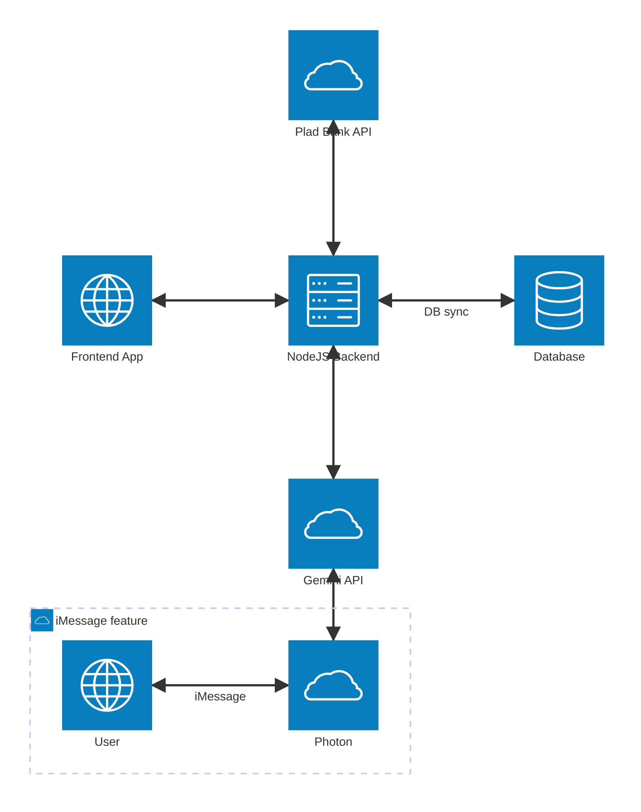

# System Design Doc

```mermaid
---
config:
  architecture:
    iconSize: 120
    fontSize: 14
---
architecture-beta
    group imessage(cloud)[iMessage feature]


    service app(internet)[Frontend App]
    service backend(server)[NodeJS Backend]
    service gemini(cloud)[Gemini API]
    service db(database)[Database]
    service photon(cloud)[Photon] in imessage
    service bankapi(cloud)[Plad Bank API]
    service user(internet)[User] in imessage

    app:R <--> L:backend
    backend:R <-[DB sync]-> L:db
    backend:B <--> T:gemini
    gemini:B <--> T:photon
    backend:T <--> B:bankapi
    photon:L <-[iMessage]-> R:user
```
